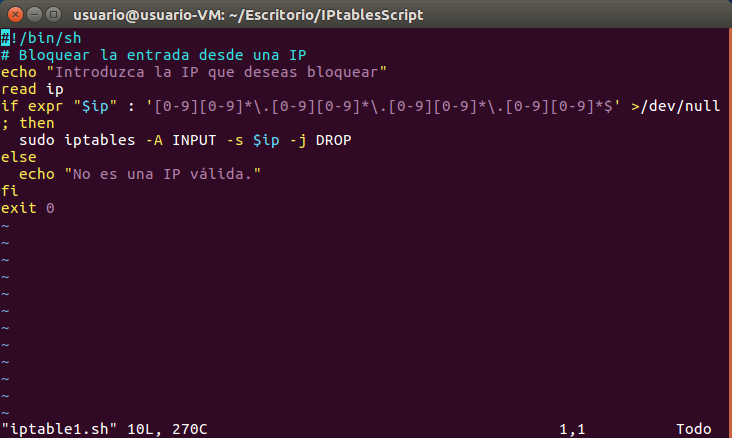
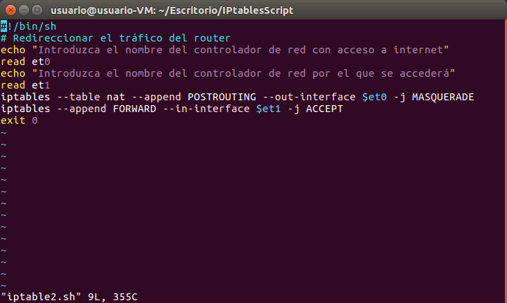
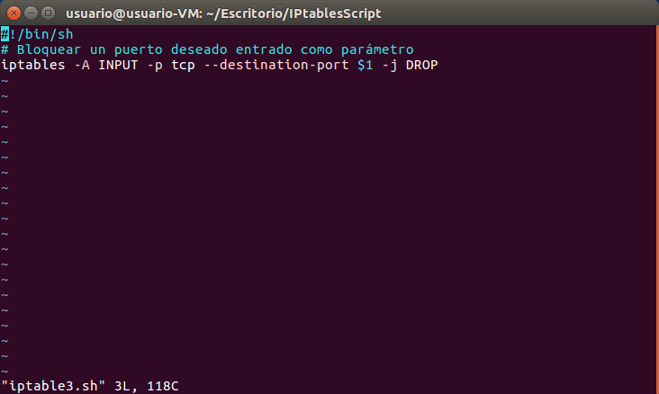
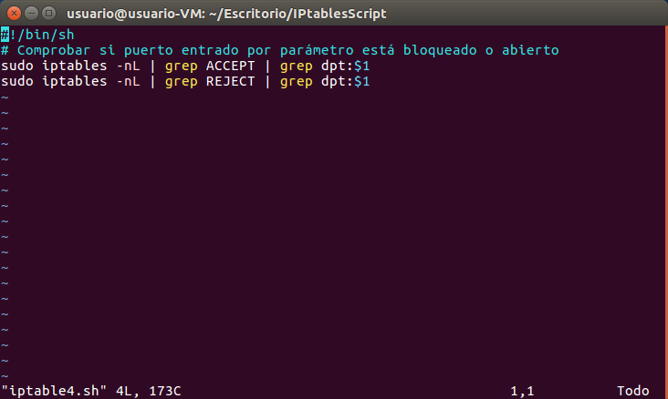

# Scripts utilizando `IPTABLES`

* Bloquear el acceso desde una IP introducida

* Redireccionar el tráfico que entra desde un controlador de red hacia el exterior mediante otro controlador de red

* Bloquear el puerto deseado entrado como parámetro del script

* Comprobar si un puerto está aceptado o rechazado por las `IPTABLES`

